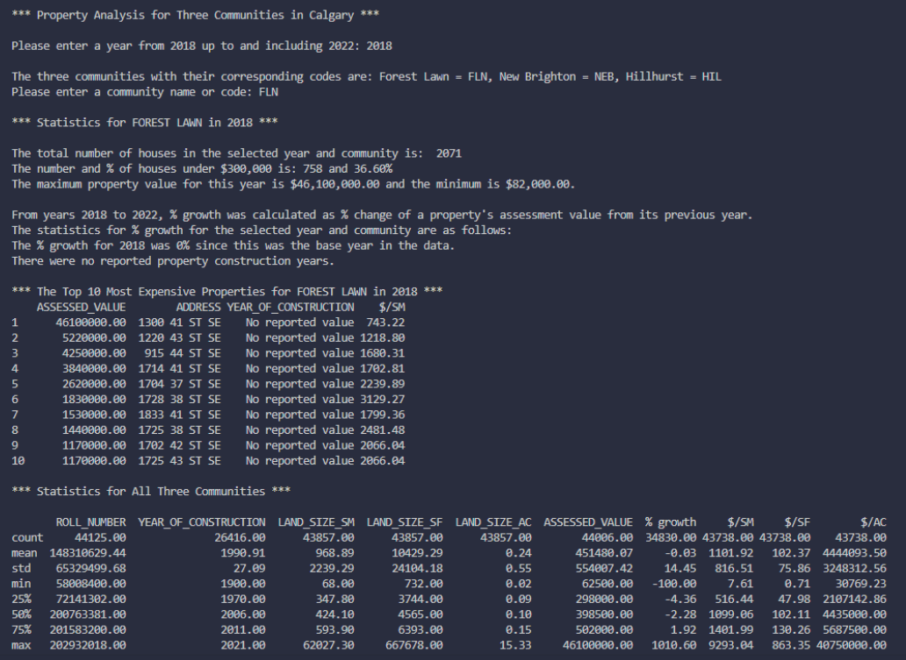
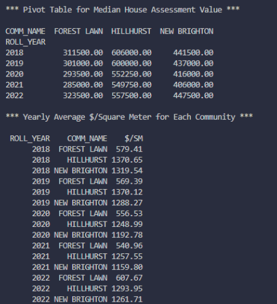
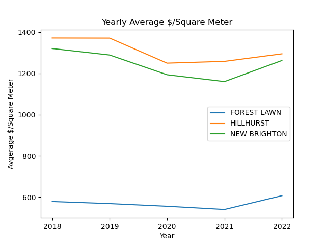

# Calgary-property-analysis
ENSF 592 P2023
Group 8: Carrie Chan and Paolo Geronimo

## Dataset
The dataset that was chosen is a subset of the City of Calgary’s “Total Property Assessed Value” dataset [1]. The complete dataset is composed of historical assessment data for residential, non-residential, and farmland properties in Calgary. Out of this dataset, the residential data was taken for the years 2018 to 2022 and for the communities of New Brighton, Hillhurst, and Forest Lawn. The chosen properties were checked to ensure that they were in different quadrants of Calgary, thus providing more variation in the data. Values in the dataset include the year of assessment, the roll number and address of the property, the assessed value, the community code and name, the year of construction, and the area of the property in square meters, square feet, and acres.

## User Input/Output
When the user runs the program, they are first prompted to enter the year they wish to analyze. After entering a valid year, they are then prompted to enter the community code or name of the community they wish to analyze. The available years of analysis are from 2018, up to and including 2022. The available communities and corresponding codes are:
- New Brighton: NEB
- Hillhurst: HIL
- Forest Lawn: FLN

After the user enters a valid combination, the program outputs the number of houses in the selected year and community. The number and percentage of houses under \$ 300,000 is also displayed. This value was chosen as an approximation for the value of a starter home. Also, the maximum and minimum property values are printed. Statistics for the growth percentage between the entered year and previous year, as well as the maximum, minimum, and median assessment values are also displayed. Next, the program shows the most common year of construction for a property. Finally, the program prints data for the top 10 highest assessed properties for the user’s chosen year and community.
Next, the program outputs statics of the whole dataset using the describe method, followed by a pivot table of the median assessment value for each community in each year. Finally, the program displays the average \$ /m2 for each community in each year as a line graph. The complete and indexed dataset and line graph are exported into the working directory.

## Specifications
The merged dataset is composed of 10 columns and 44 126 rows. Then, four new columns are added to the DataFrame when the program is executed:
- % growth from the previous year
- Dollar value per square meter
- Dollar value per square foot
- Dollar value per acre

The raw data consists of 3 files: the assessment value, the year of construction, and the land size. The 3 files are merged based on the year of assessment, the roll number, and the address. Hierarchical indexing is used along the rows. These indexes are year of assessment, community code, and community name. Duplicates are also dropped upon merging the 3 files. Zeros and infinity values are replaced with NaN values, which are then filtered out using the mask operation in order to display useful numbers. The groupby operation is used when finding the frequent years of construction and during the creation of the line graphs. A pivot table is created based on the median value for each community in each year.

## Results

## References
[1] The City of Calgary, "Total Property Assessed Value," 28 April 2023. [Online]. Available: https://data.calgary.ca/Government/Total-Property-Assessed-Value/dmd8-bmxh.

